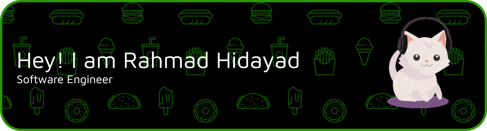

# 💫 About Me:
- 🔭 I’m currently working on **Freelancer**  
- 🌱 I’m currently learning **Fullstack Web Development and AI**  
- 📫 How to reach me **rhmad.yayat102@gmail.com**  
- ⚡ Fun fact **I think im HUNGRY 🍔🍜🍛🍕🥪**

## 🌐 Socials:
  

# 💻 Tech Stack:
                                        
# 📊 GitHub Stats:
 
 

<picture>
  <source media="(prefers-color-scheme: dark)" srcset="https://github-readme-activity-graph.vercel.app/graph?username=rahmadyd&theme=dracula&area=true">
  <source media="(prefers-color-scheme: light)" srcset="https://github-readme-activity-graph.vercel.app/graph?username=rahmadyd&theme=github&area=true">
  
</picture>

<picture>
  <source media="(prefers-color-scheme: dark)" srcset="https://raw.githubusercontent.com/rahmadyd/rahmadyd/output/github-snake-dark.svg">
  <source media="(prefers-color-scheme: light)" srcset="https://raw.githubusercontent.com/rahmadyd/rahmadyd/output/github-snake.svg">
  
</picture>
